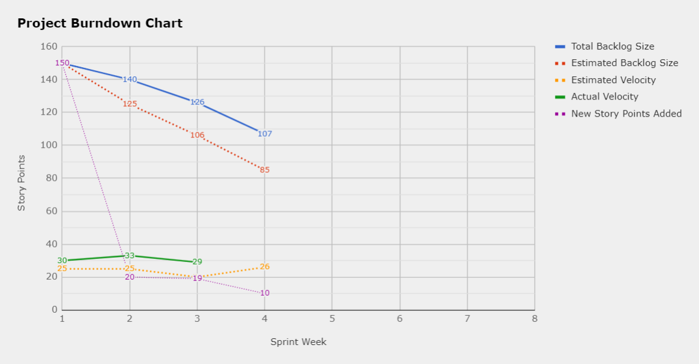

# Weekly Progress Report

This is the weekly progress report for week/sprint 3 for the "ScanOrUploadMe" project.

## Current Team Velocity

29 story points (sprint 3)

- decrease by 4 story points from sprint 2
- we have only planned for 19 story points but ended up closing two tickets with 3 story points.

## Tickets finished and the sum of their story points

The names listed below are issues that we have closed this sprint and can be found in the project's [closed column](https://github.com/IOOPM-UU/ScanOrUploadMe/projects/1):

- "send request from server to Google Cloud NLP"
- "JSON event => display 'pretty' calendar event"
- "process/transform data from google cloud to calendar event"
- "write mock JSON data => local calendar event (app)"
- "Modifying calendar event before adding to local calendar"
- "mobile app: display the result of the scan & gc processing"
- "sprint 3: progress report"

**Sum of finished story points: 29**

## Number of tickets created and the sum of their story points

We have added an additional **4 tickets** (worth 10 story points in total) at the end of sprint 3.

- **Sum of story points**: 199 story points
- **Size of backlog**: 107 story points
- **Completed**: 92 story points (sprint 1-3)

## Pull Requests

This week we have successfully created/merged the following number of pull requests.

- Created: 3
- Merged: 3

## Summary: Were all sprint goals met?

All sprint goals were met. We initially planned to work less during this sprint, however, we underestimated the amount of story points on some issues. Some issues in the backlog also overlapped with some issues we did during the sprint. So in the end, this sprint was worth more story points than we initially planned.

The sprint goals which were not completed:

- None

## Sprint Goals for the following week (sprint 3)

The following issues have been selected as the targets for next weeks sprint. The issue for each ticket can be found in the project's sprint backlog column:

- "Bug: Review time parser errors #59
- "Bug: Review Debugger Errors #56
- "Storing scanned events #17"
- "Aesthetic clean-up of home page #58"
- "Choose calendar to which an event is saved to #9"
- "Bug: Fix URL creation in images.js (server-side) #55"
- "Encryption: Implementation Mobile App <-> ExpressJS Server #31"

**Goal:**

- General quality improvement: visual and functional (worth 11 story points)
  - Aesthetic clean up #58
  - Security #31
- Add functionality (worth approx. 10 story points)
  - Add stored events tab #17
  - Add preferences/settings tab #9
- Fixing minor bugs: #56, #59, #55 (worth 7 story points)

## Video Update - ScanOrUploadMe Week 3

The video for sprint 3 can be found here: https://youtu.be/CPs4qb_Xcv8

## Project Burndown Chart

See the picture stored here:  and the original chart can be found here: [Live Burndown Chart](https://docs.google.com/spreadsheets/d/12GmSHIXMWHx2LpgqF7Fsc416dBMk8yJf_pnBWDaJ7bY/edit?usp=sharing)
